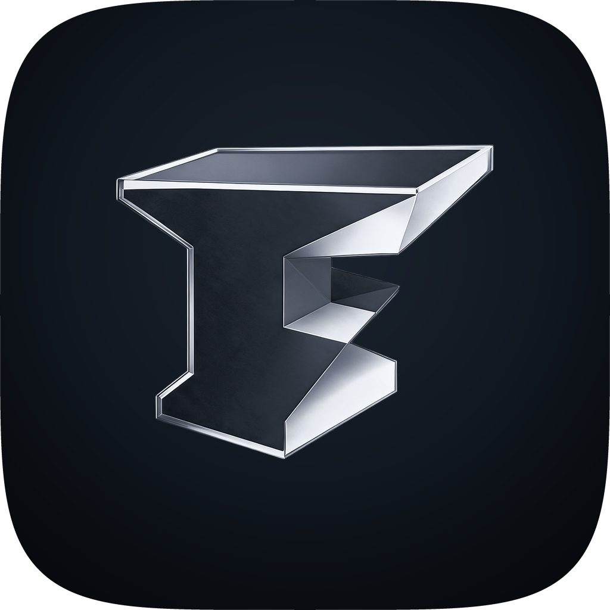
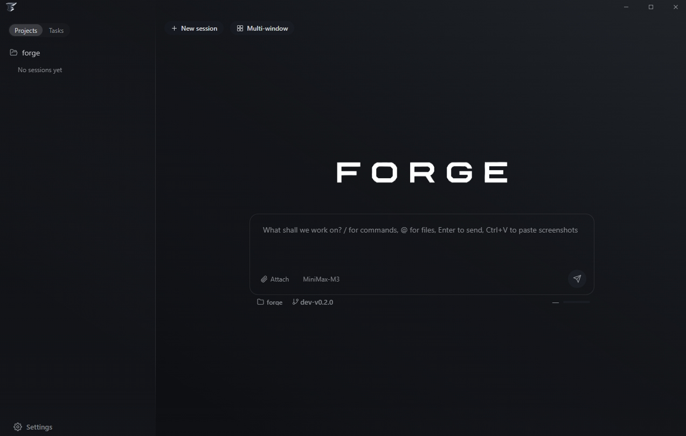
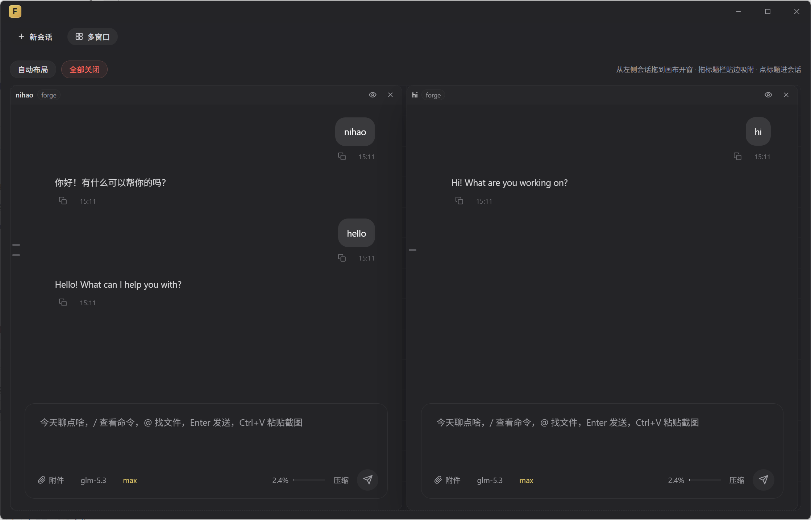

# Forge

**Forge，取「锻造」之意 —— 愿每一个好产品都从这里锻造而出。**

[English](README.md) | 简体中文

## 🪟 多窗口模式

把每个会话开成一个独立小窗口，像便利贴一样铺满屏幕，随手摆放。

从左侧会话池拖出来就能开窗，窗口可以自由缩放，推到屏幕边缘会自动吸附排好。默认给你一个四宫格，一键重新布好，一键全部收起。不同项目的会话也不打架——左边跑 A 项目，右边跑 B 项目，哪边有动静就看哪边。

## ✨ 一起看看它能做什么

**🖼️ 画布 · 说不清的，就画出来**
流程怎么走、架构长什么样、新旧方案差在哪——AI 直接输出一张活的 HTML 图示，就地渲染在回复里。沙箱中运行，可以放大、拉高、另存，也会跟着你的主题走。

**🪟 多会话窗口 · 像便利贴一样铺满屏幕**
从会话池拖出来就开窗，自由缩放，推向边缘自动吸附排版，默认四宫格一键布好。跨项目的会话也能摆在同一块画布上，哪边有动静看哪边。

**🧠 记忆 · 不用每次都重新认识你**
你的习惯和偏好被悄悄记下来，下次开工直接接上。

**📁 项目管理 · 本地文件夹加进来就能开工**
当前在哪个分支一眼看得见，想切分支也不用离开对话框。

**💬 并行会话 · 几个会话同时跑，互不打架**
同一个项目开多个会话，这边重构、那边修 bug。

**👀 执行可见 · 每一步都摊开给你看**
调了什么工具、读了哪个文件、改了哪几行，调用卡片和 Diff 并排摊开，随时回看。

**⌨️ 内嵌终端 · 改完就能跑，不用切窗口**
底部面板可以开好几个标签，每个标签都直接开在当前项目目录里。真 shell，色彩齐全，vim、top 照常用。拖上沿调高度，收起面板后台照跑——起 dev server、翻日志、敲命令，都留在同一个对话里。

**🤖 子 Agent 监控 · 后台的活儿也盯着**
派出去的任务一个个挂着标签页，进度点开就查，可以单独叫停，也能一键全停。

**🔌 模型随心配 · 用你顺手的那家**
各家模型服务都能接，密钥存在系统钥匙串里。思考强度自己调，最长支持 1M token 上下文。

**🔍 代码浏览器 · 看代码不用再切 VSCode**
侧栏一键切到项目目录树，读代码就像在 IDE 里。

**🌿 Git 提交推送 · 提交也顺手做了**
对话里直接提交、推送，提交说明让 AI 替你写好。

**📸 附件随手贴 · 截图复制粘贴就进来**
文件拖进去也行，剩下的交给 AI。

## 🧷 执行模型

Forge 以启动它的账户的完整权限执行命令。如果某个仓库需要更强的边界，请把 Forge 放进容器或虚拟机里运行。这一取舍继承自 [pi](https://github.com/earendil-works/pi) 的设计理念——真正的隔离应该交给操作系统。

## 致谢

Forge 基于 [pi](https://github.com/earendil-works/pi) 编码代理引擎构建。
