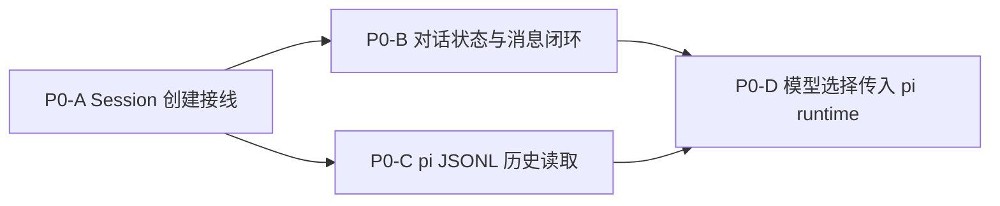

# pi 真实接入并行开发计划

> 目标：在避免接口冲突的前提下，明确哪些 P0 工作项可以并行，哪些必须串行。  
> 结论：主线串行，支线并行；不要把 session 创建和对话状态闭环拆给两个任务同时改。

## 并行策略

## 必须串行的主线

| 工作项 | 原因 |
|---|---|
| P0-A Session 创建接线 | 决定 sessionId、projectPath、pi 文件路径和 store 记录的权威映射 |
| P0-B 对话状态与消息闭环 | 直接消费 P0-A 的会话上下文，并修改 `createForgeCore` / `PiConversationAdapter` / `ConversationService` 的核心协作 |

这两个工作项都集中在同一组关键文件和数据流上。并行开发容易产生以下冲突：

- session ID 与 cwd 的传递方式不一致。
- `PiConversationAdapter` 的回调契约被双方重复改动。
- 状态事件触发时机互相覆盖。
- store 会话记录结构出现临时分支。

因此主线建议由一个开发者或一个 agent 顺序完成。

## 可并行的支线

### 支线 1：P0-C 历史读取

**启动条件**：P0-A 完成，session ID 到 pi 文件的映射稳定。  
**主要范围**：

- 新增独立的历史读取器或扩展 `PiConversationAdapter.loadHistory()`。
- 使用 pi `SessionManager` 解析 entries。
- 输出 `ConversationMessage[]`。

**可独立验证**：准备固定 pi session fixture，断言历史顺序和角色。  
**注意**：不要先改 UI 渲染逻辑；等后端历史契约稳定后再接前端。

### 支线 2：错误与状态 UI

**启动条件**：现有 `conversation.statusChanged` 和 `conversation.error` 契约已经存在。  
**主要范围**：

- streaming 中禁用发送。
- error / canceled 状态恢复输入与按钮。
- 缺少 API key、provider 未配置、模型不可用给出可读提示。
- 取消后保留已生成文本的视觉状态。

**可独立验证**：用 mock bridge 或注入假事件驱动组件状态。

## 不建议提前并行的工作项

| 工作项 | 原因 |
|---|---|
| P0-D 模型选择传入 pi runtime | 需要稳定的真实对话链路做验收；提前做容易围绕错误的模型对象形态返工 |
| 工具事件映射 | 属于 P1，且依赖 P0-B 的真实 pi 事件流稳定 |
| 项目信任机制 | 属于 P2；当前 `.pi` 目录检测只是 forge 本地缓存，不应阻塞主链路 |
| 富文本渲染重构 | 可以局部准备，但最终验收依赖真实流式输出节奏 |

## 推荐执行批次

| 批次 | 内容 | 并行方式 |
|---|---|---|
| Batch 1 | P0-A + P0-B | 主线单人串行完成 |
| Batch 1 支线 | P0-C 后端历史解析 | 在 P0-A 合并后并行 |
| Batch 1 支线 | 错误与状态 UI | 随时可并行，按现有事件契约为准 |
| Batch 2 | 接入 P0-C 历史读取 + P0-D 模型选择 | 主线稳定后合并 |
| Batch 3 | 多会话并发集成测试 | 所有 P0 功能完成后统一验收 |
