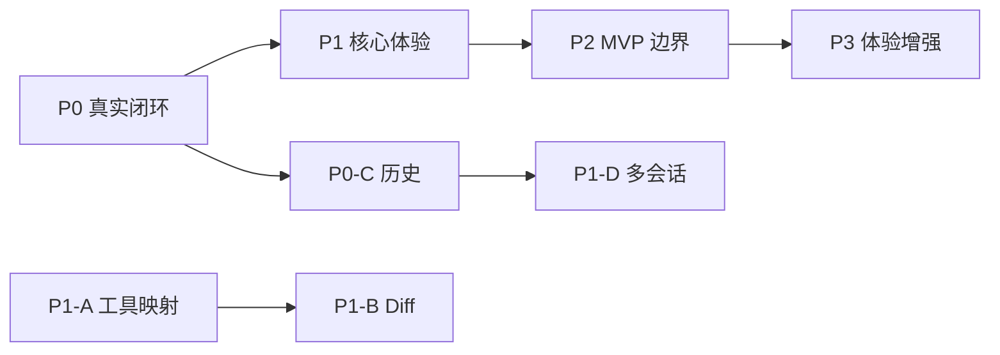

# pi 真实接入全量路线图

> 范围：MVP 剩余开发，覆盖 P0–P3。  
> 目标：先完成真实 pi 最小可用闭环，再补齐核心体验、MVP 边界能力和体验增强。  
> 状态基线：2026-08-24。

## 总览

| 优先级 | 阶段目标 | 完成标准 |
|---|---|---|
| P0 | 真实 pi 会话与对话最小闭环 | 用户可用真实项目、真实模型完成流式对话，重启后可恢复历史 |
| P1 | 核心体验稳定 | 工具调用可见、模型切换真实生效、多会话并行不串扰 |
| P2 | MVP 边界能力完整 | 项目信任、安全富文本、异常降级符合 PRD |
| P3 | 体验增强与打磨 | 上下文用量、附件、窗口布局和密钥安全达到可用发布质量 |

## P1：核心体验稳定

### P1-A：工具事件真实映射

**状态：未开始**  
**依赖：P0-B 完成**

#### 目标

- 将 pi 工具事件映射为 forge 的 `tool.started` / `tool.completed` / `tool.error`。
- 对话流中实时显示工具卡片状态。

#### 实现范围

1. 映射 pi `tool_execution_start` 到 `tool.started`。
2. 映射 pi `tool_execution_end`：
   - `isError=false` → `tool.completed`
   - `isError=true` → `tool.error`
3. 透传 `toolCallId`、工具名、入参摘要、结果文本或错误信息。
4. 先支持 read / write / edit / bash / powershell 五类基础工具。

#### 验收

- AI 调用工具时 UI 出现运行中卡片。
- 工具完成后状态变为成功或失败。
- 工具失败不影响后续助手消息渲染。

### P1-B：edit 工具并排 Diff

**状态：未开始**  
**依赖：P1-A 完成**

#### 目标

- edit 类工具展示旧内容与新内容的并排视图。

#### 实现范围

1. 从 pi edit 输入中提取文件路径、旧文本、新文本。
2. 按行生成并排 diff。
3. 高亮新增行、删除行、替换行。
4. 大 diff 限制初始渲染行数并提供展开入口；虚拟滚动可后置到性能验证后再做。

#### 验收

- 正常编辑显示准确的增删改内容。
- 新建文件能渲染为全量新增。
- 缺失旧文本时降级显示新文本，不崩溃。

### P1-C：模型选择真实生效

**状态：未开始**  
**依赖：P0-D 完成**

#### 目标

- 全局默认模型与会话覆盖模型在真实请求中生效。

#### 实现范围

1. 解析 pi `models.json` 中 provider、协议、model id 和凭据引用。
2. 将 forge 模型字符串转换为 pi runtime 可用的 model 对象。
3. 新会话创建时注入目标模型。
4. 运行中会话优先使用 pi 支持的热切换 API；不支持时下一轮生效并提示用户。

#### 验收

- 切换会话模型后，下一轮请求命中目标模型。
- 清除覆盖后回落到全局默认。
- 模型不可用时返回稳定错误提示。

### P1-D：多会话并行与历史隔离

**状态：未开始**  
**依赖：P0-A / P0-B / P0-C 完成**

#### 目标

- 多个真实 pi 会话可以同时执行且互不干扰。

#### 实现范围

1. 每个 sessionId 维护独立 `AgentSession` lease。
2. 所有 delta、message、status、tool 事件按 sessionId 过滤。
3. 会话切换只改变观察焦点，不停止后台任务。
4. 增加两个真实 session 并发发送的集成测试。

#### 验收

- 会话 A streaming 时切换到会话 B 不中断 A。
- B 的输出不会出现在 A 的消息流中。
- 关闭窗口或切换视图后后台会话继续执行。

## P2：MVP 边界能力

### P2-A：项目信任机制接 pi

**状态：未开始**

#### 目标

- 用 pi 的项目信任机制替代当前仅检测 `.pi` 目录的本地信任状态机。

#### 实现范围

1. 对接 pi trust store 或 trust event。
2. 项目首次打开且包含 `.pi` 资源时触发询问。
3. 支持 trust / reject / trust once 三种决策。
4. 信任通过后加载项目级扩展和配置；拒绝后阻止项目级资源加载，基础会话仍可用。
5. forge store 只缓存展示状态，权威状态交给 pi。

#### 验收

- 含项目资源的目录首次打开出现信任弹窗。
- 拒绝后基础对话仍可用。
- 已确定状态重复打开不重复询问。

### P2-B：Markdown 安全渲染与代码高亮

**状态：未开始**

#### 目标

- 替换当前正则 Markdown 渲染，达到 PRD 要求的安全富文本效果。

#### 实现范围

1. 引入 Markdown 解析器和白名单 sanitizer。
2. 禁止原生 HTML 与危险协议链接。
3. 增加代码块语言识别和高亮。
4. 流式期间采用低成本增量渲染，结束后做一次完整格式化。
5. 补 XSS 回归测试。

#### 验收

- 常见 Markdown 结构正确渲染。
- 恶意 HTML / script 被转义或移除。
- 长代码块滚动流畅。

### P2-C：Mermaid 渲染

**状态：未开始**  
**依赖：P2-B 完成**

#### 目标

- 助手消息中的 Mermaid 代码块渲染为图表。

#### 实现范围

1. 识别 `mermaid` fenced code block。
2. 流式结束且语法合法后渲染。
3. 渲染失败显示原始代码和错误提示。
4. 控制并发渲染数量，避免长会话卡顿。

#### 验收

- 合法图表正确显示。
- 非法语法不崩溃并保留原文。

### P2-D：异常、状态一致性与恢复

**状态：未开始**

#### 目标

- provider、session 文件、进程中断等异常有稳定降级路径。

#### 实现范围

1. provider 未配置时禁止发送并引导设置页。
2. pi session JSONL 损坏时给出修复/备份/重建提示。
3. 应用重启后恢复会话列表和历史。
4. 删除运行中会话前先 stop / dispose。
5. 统一错误码映射，避免直接暴露堆栈。

#### 验收

- 异常场景均有人类可读反馈。
- 重启后活跃会话可继续。
- 删除运行中会话没有 AgentSession 泄漏。

## P3：体验增强

### P3-A：上下文用量与压缩入口

**状态：未开始**

#### 实现范围

1. 从 pi session stats 或 context usage 读取 token 数据。
2. 显示当前用量百分比和接近上限提醒。
3. 提供手动压缩入口。
4. 展示最近一次压缩结果或失败原因。

#### 验收

- 用量随对话更新。
- 达到阈值时有视觉警告。
- 手动压缩失败不破坏会话历史。

### P3-B：附件输入

**状态：未开始**

#### 实现范围

1. 支持选择本地图片或文本附件。
2. 图片转换为 pi 支持的 image content。
3. 文本附件转为结构化上下文或受控 prompt 片段。
4. 上传/转换失败可移除重试。

#### 验收

- 合法附件随消息进入模型请求。
- 不支持类型有明确拒绝提示。

### P3-C：多窗口布局打磨

**状态：部分完成**

#### 当前已有

- 应用内多窗口画布。
- 拖拽开窗、关闭回池、置顶、边缘/四角吸附预览、4 窗格排列。

#### 剩余范围

1. 持久化窗口布局与会话绑定关系。
2. 会话删除时自动关闭对应窗口。
3. 窗口组件异常时支持从会话池重开并恢复历史。
4. 小尺寸画布下的最小尺寸与碰撞优化。
5. 补齐 PRD 多窗口 E2E。

### P3-D：密钥安全增强

**状态：部分完成**

#### 当前已有

- models.json 双向同步。
- 环境变量引用作为 MVP 降级方案。

#### 剩余范围

1. Windows 下接入 DPAPI 或系统 credential store。
2. macOS/Linux 后续适配。
3. 导入既有 pi 明文 key 时提供迁移为安全引用的可选流程。
4. 配置变更记录审计日志。
5. 禁止 UI 日志或错误信息泄露完整 key。

## 执行顺序建议

## 发布门槛

MVP 内测至少满足：

1. P0 全部完成。
2. P1-A、P1-C、P1-D 完成。
3. P2-A、P2-B、P2-D 完成。
4. 核心回归测试全部通过。
5. 已知阻断问题数量为零。

Mermaid、附件、布局持久化和完整 keychain 可以在首个内测版本后迭代。
